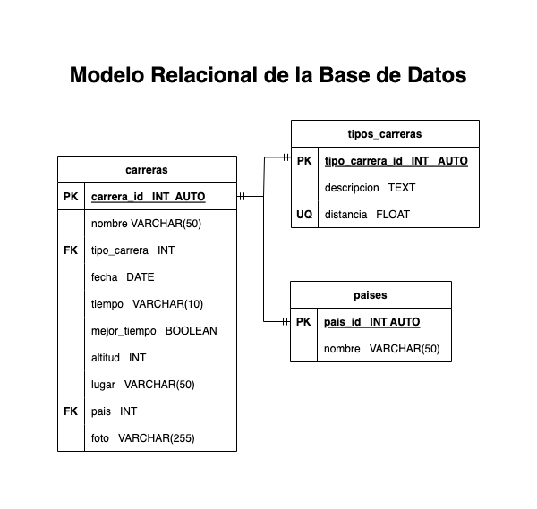

# Carreras

## Listado de entidades

### carreras **( ED - Entidad de Datos )**

* carrera_id **( PK )**
* nombre
* tipo_carrera_id **( FK )**
* fecha
* tiempo
* mejor_tiempo
* altitud
* lugar
* pais_id **( FK )**
* foto

### tipos_Carreras **( EC - Entidad de Catalogo )**

* tipo_carrera_id **( PK )**
* descripcion
* distancia **(UQ)**

### paises **( EC - Entidad Catalogo )**

* pais_id **( PK )**
* nombre

## Relaciones

1. Una **carrera** _pertenece_ a un **tipo de carrera** (_1 a M_)
1. Una **carrera** se _corre_ a un **pais** (_1 a M_)

## Diagrams

### Modelo Entidad Relacion - MER

### Modelo Relacional - MR

## Reglas de Negocio 

Operaciones crud

### carreras 

1. Crear el registro de una carrera
1. Leer el registro de una o varias carreras en dada una condicion en particular
1. Leer todos los registros de la entidad carrera
1. Actualizar los datos de una carrear
1. Eliminar los datos de una carrera dada una condicion en particular

### tipos_Carreras

1. Crear el registro de un tipo de carrera
1. Leer el registro de una o varios tipos de carrera
1. Leer todos los registros de la entidad tipo de carrera
1. Actualizar los datos de un tipo de carrera dada una condicion en particular
1. Eliminar los datos de un un tipo carrera dada una condicion en particular

### paises

1. Crear el registro de un pais
1. Leer el registro de uno o varios paises dada una condicion en particular
1. Leer todos los registros de la entidad paises
1. Actualizar los datos de un pais dada una condicion en particular
1. Eliminar los datos de un pais dada una condicion en particular

