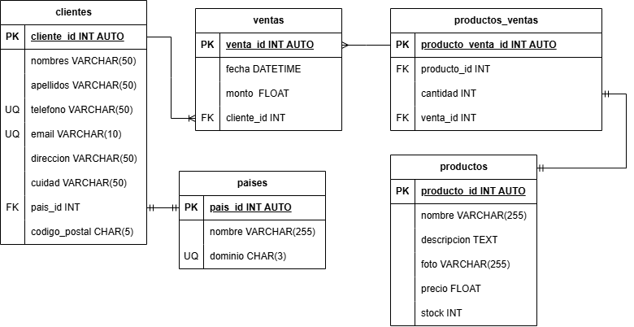

# Ventas

Diseño y modelado de una base de datos para una tienda de tecnologia

## Listado de entidades

### clientes **(ED)**
- cliente_id **(PK)**
- nombres
- apellidos
- telefono **(UQ)**
- email **(UQ)**
- direccion
- cp
- cuidad
- pais_id **(FK)**

### productos **(EC)**
- producto_id **(PK)**
- nombre
- descripcion
- foto
- precio
- stock

### ventas **(ED)**
- venta_id **(PK)**
- fecha
- monto
- cliente_id **(FK)**

### prodcutos_ventas **(EP)**
- producto_venta_id     
- venta_id **(PK, FK)**
- producto_id **(PK, FK)**
- cantidad

### paises **(EC)**
- pais_id **(PK)**
- nombre
- dominio **(UQ)**

## Modelos

### Modelo Relacional

## Relaciones

### clientes
1. Un cliente pertenece a un pais (1 a 1)

### ventas
1. Un cliente genera una o muchas ventas (1 a M)

### productos_ventas
1. Una venta puedo incluir muchos productos (1 a M)

## Reglas de negocio

### Entidad Cliente
- Crear un cliente
- El telefono debe ser unico
- El email debe ser unico
- Leer todos los clientes
- Leer los datos de un cliente en particular dada una condicion
- Actualizar un cliente
- Eliminar un cliente

### Entidad Productos
- Crear un producto
- Leer todos los producto
- Leer los datos de un producto en particular dada una condicion
- Actualizar un producto
- Eliminar un producto
- Cada que se haga un venta restar a la cantidad de productos disponibles, el numero productos que se vendieron

### Entidad Ventas
- Crear una venta
- Leer todas las ventas
- Leer los datos de una venta en particular dada una condicion
- Leer todas las ventas de un cliente
- Leer todas las ventas de un producto
- Actualizar una venta
- Eliminar una venta

### Entidad Paises
- Crear un pais
- Leer todos los paises
- Leer los datos de un pais en particular dada una condicion
- Actualizar un pais
- Eliminar un pais