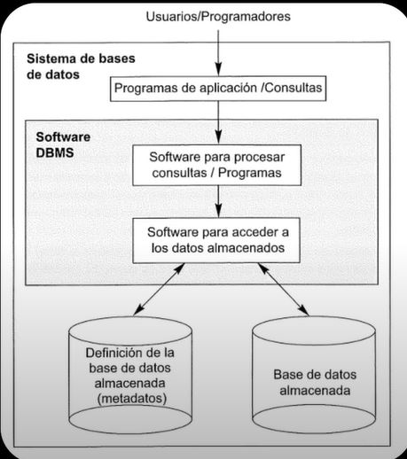

# Bases de datos

Indice de temas:

1. [Design](./01-DESING/)
2. [Modelado](./02-MODELLING/)
3. [SQL](./03-SQL/)
4. [NoSQL]()

## Que es una Base de Datos?

Una base de datos es un conjunto organizadado de informacion o datos, que se almancenan y gestionan de forma estructurada en un sistema. Su objetivo es acceder, conultar, modificar y administrar esa informacion de manera eficiente


## Bases de datos relacionales
Es un tipo de base de datos que organiza la informacion en tablas, donde cada tabla esta compuesta por columna(atributos) y filas(registros) estos pueden o no hacer referencia a otro campo de otra tabla.


## Entidades
Es la representacion de un objeto del mundo real


### Tipos de entidades
* Entidades de datos
* Entidades Catalogo
* Entidades Pivote / Asociacion / Enlace


## Reglas de negocio
Son normas que determinan como deben manejarse los datos y aseguran que el sistema respete la logica del mundo real. No son reglas tecnicas sino reglas funcionales que definen lo que es valido o no en un modelo de datos.

**Ejemplo: DB para una tienda en linea**
* Un cliente no puede hacer un pedido sino tiene una direccion registrada
* No se puede vender un producto si no hay suficiente inventario disponible
* El campo "correo electronico" de ser unico para cada usuario

**Se pueden aplicar en varios niveles:**

* Bases de datos:
    * Restricciones(check, unique, foreign key)

* Aplicacion:
    * Validacion en el codigo antes de enviar datos a la base de datos

* Interfaz de usuario
    * Formularios que no permitan dejar campos vacios, o que filtran opciones

**Son importantes por:**
* Mantienen la integridad de los datos
* Evitan errores logicos y problemas en los procesos de negocio
* Ayudan a que la base de datos refleje correctamente el modelo real del sistema

### Logica de Negocio
Conjunto de reglas, politicas y procedimientos que definen como se usan y manipulan los datos para cumplir con los objetivos de una aplicacion o sistema

* Reglas de validacion
* Restricciones
* Procedimientos de almacenado y triggers


## Normalizacion
Es un proceso que se utiliza para organizar y optimizar la estructura de la base de datos, consiste en la organizacion de las tablas y sus relaciones para:

* Reducir la redundancia - Que no se repitan datos innecesarios
* Mejorar la integridad - Que los datos sean consistentes y correctos
* Facilitar el mantenimiento - Actualizar, insertar o eliminar sin errores

Para normalizar una base de datos se usan las llamdas Formas Normales, cada forma normal corrige un tipo de problema:

### 1FN Primera forma normal
Cada atributo de una entidad debe contener un solo valor atomico, es decir los valores deben ser indivisibles no puden ser divididos en atributos mas pequeños

```
No debe haber columnas repetidas ni valores multiples en una celda, se soluciona creando otra tabla o registros separados
```


### 2FN Segunda forma normal
Ademas de cumplir la primer forma normal, cada atributo no dependiente funcionalemente de la llave principal debe estar en una entidad separada

```
Cada columna depende por completo de la llave primaria, de una parte de ella
```

### 3FN Tercer forma normal
Ademas de cumplir la primer y segunda forma normal, Todas las dependencias funcionales deben ser eliminadas, es decir no debe de existir dependencias funcionales transitorias

```
Niguna columna debe depender de otra que no sea clave primaria(evitar dependencias transitivas)
```

### 4FN Cuarta forma normal - Boyce Codd
Requiere que cada dependencia funcional sea una clave candidata unica


### 5FN Quinta forma normal - Dominio - Clave
Se garantiza que no haya dependencias multiples de conjuntos de entidades

---

### Dependencias

```
Dependencia funcional -> Cuando un atributo depende directamente de otro (clave -> Atributo)

Dependecia tranitoria -> Cuando un atributo depende de la clave primaria a través de otro atributo
```


## Modelado
Es el proceso de representar la informacion y sus relacioenes antes de ser implementada en un SGBD


### Modelo Conceptual (MER)
* Modelo entidad relacion
* Descripcion conceptual de las entidades, atributos y relaciones
* Es la parte mas abstracta: se definen las entidades, atributos y relaciones sin pensar todavia en motor de bases de datos

#### Diagrama Entidad Relacion
Cuando lo represento visualmete
El DER es cuando grafico o dibujo apartir del modelo conceptual MER las entidades, atributos y relaciones 

### Modelo Logico (MR)
* Aqui se transforma el MER en un modelo relacional
* Se pasan las entidades y relaciones a tablas, columnas, llaves primarias y foraneas
* Aqui ya aparecen las dependencias funcionales y la normalizacion

### Modelo Fisico
* Es el diseño ya pensado para un SGBD especifico(MySQL, PostreSQL, SQL Server ...)
* Se crean los scripts que crean las tablas


## Data Base Managment System - DBMS

Es un software especializado que sirve para crear, administrar y manipular base de datos de manera eficiente y segura.

* Las base de datos se encuentran en el nivel mas bajo dentro de un entorno de sistemas de bases de datos
* Generalmente se los considera como la parte fisica ya que, aunque sean un contenido logico, se encuentran almacenadas y creadas en un dispositivo fisico. Por ejemplo: Un servidor

Para que un usuario pueda acceder a los datos de en una base de datos, se necesita un software especial concido como SGBD (Sitema Gestor de Bases de Datos) o en ingles DBMS (Data Base Managment System)



SGBD mas conocidos:
* MySQL
* MariaDB
* PostreSQL - PS
* SQL Server

No relacionales:
* MongoDB
* Cassandra
* Elastic Search

# Tipos de datos
Tipos de datos mas usados:

- VARCHAR -> Cadena de texto variable, con una longitud maxima especificada
- CHAR -> Cadena de texto fija, con una longitud especifica
- INT -> Numero entero positivo o negativo
- BIGINT -> Numero entero grande, positivo o negativo
- FLOAT -> Numero decimal simple
- DOUBLE -> Numero decimal de doble precision
- DECIMAL -> Numero decimal con precision fija
- DATE -> Fecha con valores de año, mes y dia
- TIME -> Hora, con valores de hora, minutos y segundos
- DATETIME -> fecha y hora combinadas
- TIMESTAMP -> Marca de tiempo que indica un momento especifico en el tiempo
- BOOLEAN -> Valor boleano, verdadero o faldo
- BLOB -> Objeto binario grande, para almacenar datos binarios, como imagenes o archivos
- JSON -> Formato de texto estructurado para el intercambio de datos